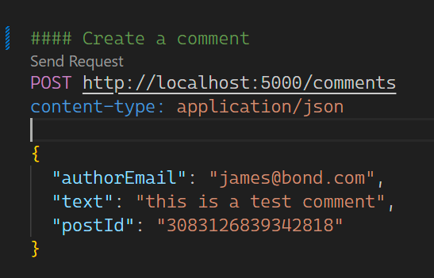
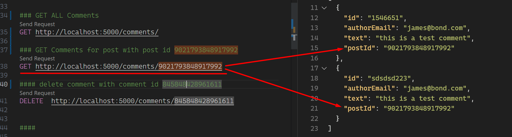

# Praktika

back ende dar karta pasidarytke `git fetch;git pull;`

## NewPostForm

1. atsispausdini klaidu masyva is back end
2. atvaizduoti klaidas useriui
3. isspausdinti kazkokiam dive ar ul
4. nustatos kaip klaida formike su formik.setErrors({title: 'must be 5 charackters'})

## Komentarai

1. naujo komentaro forma siusti su siais duomenimis, backas sito nevaliduoja, validuojam fronte.
   

2. rest.rest faile back ende surasyta kaip gauti komentarus
   

3. atejus i konkretu postas atvaizduoji jo komentarus
4. prie komentaro prideti delete mygtuka, matoma tik prisijungus. istrinti comentara mygtuko paspaudimu.
